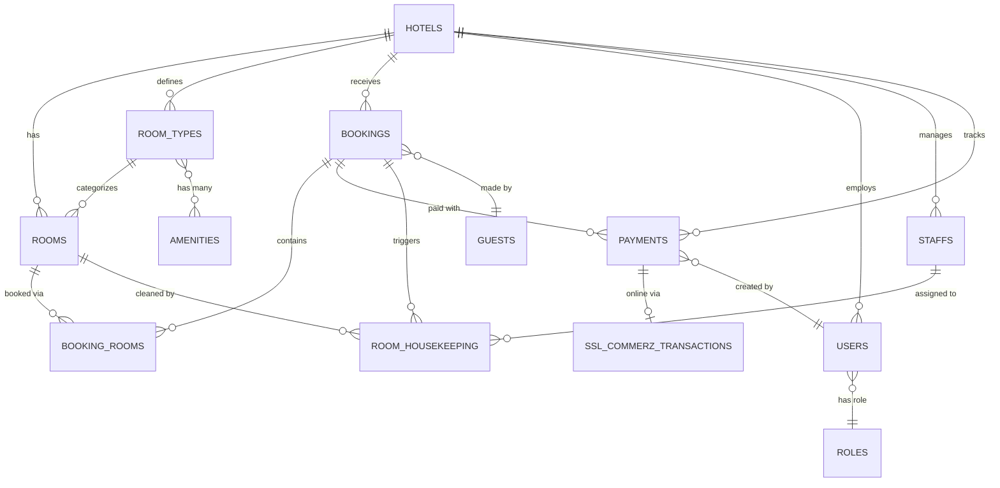

<
- [Key Features](#-key-features)
- [Screenshots](#-screenshots)
- [Architecture](#-architecture)
- [Tech Stack](#-tech-stack)
- [Prerequisites](#-prerequisites)
- [Installation](#-installation)
- [Configuration](#-configuration)
- [Usage](#-usage)
- [Project Structure](#-project-structure)
- [Database Schema](#-database-schema)
- [API Endpoints](#-api-endpoints)
- [Scheduled Tasks](#-scheduled-tasks)
- [Payment Gateway (SSLCommerz)](#-payment-gateway-sslcommerz)
- [Testing](#-testing)
- [Deployment](#-deployment)
- [Contributing](#-contributing)
- [License](#-license)

---

## Overview

**Hotel Management PMS** is a comprehensive web-based property management system that streamlines day-to-day hotel operations — from room inventory and guest bookings to payment processing and housekeeping workflows. Built on **Laravel 12** with a modern **Tailwind CSS 4 + Vite 7** frontend pipeline, it provides an intuitive dashboard with real-time occupancy tracking, booking statistics, and revenue analytics.

The system supports **multi-hotel tenancy** (each user belongs to a hotel), role-based access control, online payment via **SSLCommerz**, PDF invoice generation, and automated no-show handling.

---

## ✨ Key Features

| Module | Highlights |
|---|---|
| **Dashboard** | Real-time occupancy rate, monthly revenue, booking trends (6-month chart), booking statistics pie chart, recent bookings |
| **Room Management** | Room types with amenities, floor-based inventory, dynamic status engine (available / occupied / reserved / dirty / cleaning / maintenance) |
| **Booking Engine** | Multi-room bookings, per-room pricing & date ranges, reservation calendar (FullCalendar), available-room search, booking lifecycle (reserved → checked_in → checked_out / cancelled / no_show) |
| **Check-in / Check-out** | Date validation, minimum 50% advance for check-in, 100% settlement for check-out, auto-housekeeping task creation on checkout |
| **Payment System** | Advance / balance / refund types, multiple methods (cash, card, mobile banking, bank transfer), soft-deleted audit trail, staff attribution, PDF invoices & receipts |
| **Online Payment** | SSLCommerz gateway integration (sandbox & production), IPN verification, server-to-server callbacks |
| **Housekeeping** | Task board grouped by room, staff assignment, completion tracking, automatic room status transitions |
| **User Management** | Role-based access (Admin, Manager, Receptionist, etc.), user archive/restore, hotel-scoped data isolation |
| **Hotel Management** | Multi-hotel support, hotel profiles with logo, slug-based routing |
| **Automation** | Scheduled `bookings:auto-no-show` command — marks unattended reservations as no-show after a 12-hour grace period |
| **Guest Booking API** | Public REST API (`/api/guest/`) for guest-facing portals & mobile apps — hotel lookup, room search, availability check, booking creation, and self-service cancellation |
| **Notifications** | Email notifications via SMTP (Gmail) |

---

## 📸 Screenshots

> _To add screenshots, place images inside `docs/screenshots/` and reference them here._

<!-- 


-->

---

## 🏗 Architecture

```
┌─────────────────────────────────────────────────────────┐
│                      Browser / Client                   │
└──────────────────────────┬──────────────────────────────┘
                           │  HTTP / HTTPS
┌──────────────────────────▼──────────────────────────────┐
│                   Laravel 12 Application                │
│  ┌──────────┐  ┌────────────┐  ┌─────────────────────┐  │
│  │  Routes  │→ │ Controllers│→ │  Blade Views + Vite  │  │
│  └──────────┘  └─────┬──────┘  └─────────────────────┘  │
│                      │                                   │
│              ┌───────▼───────┐                           │
│              │ Eloquent ORM  │                           │
│              │   (Models)    │                           │
│              └───────┬───────┘                           │
│                      │                                   │
│  ┌───────────────────▼────────────────────────────────┐  │
│  │              MySQL Database                        │  │
│  │  hotels · rooms · room_types · bookings ·          │  │
│  │  booking_rooms · payments · guests · users ·       │  │
│  │  roles · staffs · room_housekeeping ·              │  │
│  │  ssl_commerz_transactions · amenities              │  │
│  └────────────────────────────────────────────────────┘  │
│                                                          │
│  ┌────────────────┐  ┌──────────────────────────────┐    │
│  │ Task Scheduler │  │  SSLCommerz Payment Gateway   │    │
│  │ (auto no-show) │  │  (IPN callbacks)              │    │
│  └────────────────┘  └──────────────────────────────┘    │
└──────────────────────────────────────────────────────────┘
```

---

## 🛠 Tech Stack

| Layer | Technology |
|---|---|
| **Backend** | PHP 8.2+, Laravel 12 |
| **Frontend** | Blade templates, Tailwind CSS 4, Bootstrap 5, Vite 7 |
| **Database** | MySQL 8.0 (table prefix: `htl_`) |
| **Auth** | Laravel UI (session-based), Laravel Sanctum (API tokens) |
| **PDF Generation** | barryvdh/laravel-dompdf |
| **Payment Gateway** | SSLCommerz (sandbox + production) |
| **Queue** | Database driver |
| **Cache** | File driver (configurable) |
| **Mail** | SMTP (Gmail) |
| **Dev Tools** | Laravel Pail (real-time logs), Laravel Pint (code style), PHPUnit 11 |

---

## 📋 Prerequisites

Before you begin, ensure you have the following installed:

- **PHP** ≥ 8.2 with extensions: `mbstring`, `xml`, `pdo_mysql`, `openssl`, `curl`, `gd`
- **Composer** ≥ 2.x
- **Node.js** ≥ 18.x & **npm** ≥ 9.x
- **MySQL** ≥ 8.0 (or MariaDB ≥ 10.6)
- **XAMPP** / **Laragon** / any local PHP development environment (optional)
- **Git**

---

## 🚀 Installation

### 1. Clone the Repository

```bash
git clone https://github.com/biplabhosen/Hotel_Management.git
cd Hotel_Management
```

### 2. Install Dependencies

```bash
composer install
npm install
```

### 3. Environment Setup

```bash
cp .env.example .env
php artisan key:generate
```

### 4. Configure the Database

Edit `.env` and set your database credentials:

```dotenv
DB_CONNECTION=mysql
DB_HOST=127.0.0.1
DB_PORT=3306
DB_DATABASE=hotel_management
DB_USERNAME=root
DB_PASSWORD=
DB_PREFIX=htl_
```

Create the database in MySQL:

```sql
CREATE DATABASE hotel_management CHARACTER SET utf8mb4 COLLATE utf8mb4_unicode_ci;
```

### 5. Run Migrations

```bash
php artisan migrate
```

### 6. (Optional) Seed Sample Data

```bash
php artisan db:seed
```

### 7. Build Frontend Assets

```bash
# Development (with hot-reload)
npm run dev

# Production
npm run build
```

### 8. Start the Application

```bash
php artisan serve
```

Visit **http://127.0.0.1:8000** in your browser.

#### 🚀 One-Command Dev Start (recommended)

The project includes a convenience Composer script that starts the web server, queue worker, log viewer, and Vite simultaneously:

```bash
composer dev
```

This runs all four processes in parallel using `concurrently`.

---

## ⚙ Configuration

### Mail (SMTP)

Configure outbound email in `.env`:

```dotenv
MAIL_MAILER=smtp
MAIL_HOST=smtp.gmail.com
MAIL_PORT=587
MAIL_USERNAME=your-email@gmail.com
MAIL_PASSWORD=your-app-password
MAIL_FROM_ADDRESS=noreply@yourhotel.com
MAIL_FROM_NAME="${APP_NAME}"
```

> **Tip:** For Gmail, generate an [App Password](https://myaccount.google.com/apppasswords) instead of using your regular password.

### SSLCommerz Payment Gateway

See the dedicated section: [Payment Gateway (SSLCommerz)](#-payment-gateway-sslcommerz).

### Queue

The application uses a **database** queue driver by default. Start a queue worker alongside the application:

```bash
php artisan queue:listen --tries=3
```

### Task Scheduler

Enable the Laravel scheduler for automated tasks (e.g., auto no-show):

**Windows (Task Scheduler):**
```
php C:\path\to\artisan schedule:run
```
Set to run every minute.

**Linux / macOS (cron):**
```
* * * * * cd /path/to/project && php artisan schedule:run >> /dev/null 2>&1
```

---

## 📖 Usage

### Booking Lifecycle

```
  ┌──────────┐     ┌────────────┐     ┌──────────────┐     ┌──────────────┐
  │ Reserved  │ ──→ │ Checked In │ ──→ │ Checked Out  │     │  Cancelled   │
  └──────────┘     └────────────┘     └──────────────┘     └──────────────┘
       │                                                          ▲
       │                                                          │
       └──────────────────────────────────────────────────────────┘
       │
       ▼
  ┌──────────┐
  │ No Show  │  (auto – after 12h grace period)
  └──────────┘
```

### Check-in Rules

| Condition | Requirement |
|---|---|
| Booking status | Must be `reserved` |
| Date | Check-in date must match **today** |
| Payment | Minimum **50%** advance payment required |

### Check-out Rules

| Condition | Requirement |
|---|---|
| Booking status | Must be `checked_in` |
| Payment | **100%** of total amount must be paid |

### Payment Types

| Type | Description |
|---|---|
| `advance` | Initial payment collected before or at check-in |
| `balance` | Remaining payment at check-out |
| `refund` | Refund tracked as a separate negative transaction |

### Room Status Engine

Room status is **dynamically computed** based on booking state:

| Status | Meaning |
|---|---|
| `available` | No active booking, ready for guests |
| `occupied` | Guest currently checked in |
| `reserved` | Upcoming confirmed booking for today |
| `dirty` | Guest checked out, awaiting cleaning |
| `cleaning` | Housekeeping staff assigned and in progress |
| `maintenance` | Under maintenance (manual) |
| `out_of_order` | Not available for booking (manual) |

---

## 📁 Project Structure

```
Hotel_Management/
├── app/
│   ├── Console/
│   │   ├── Commands/
│   │   │   └── AutoNoShowBookings.php    # Scheduled no-show command
│   │   └── Kernel.php                    # Task scheduler registration
│   ├── Http/
│   │   └── Controllers/
│   │       ├── BookingCheckoutController.php
│   │       ├── BookingController.php
│   │       ├── HomeController.php        # Dashboard + API stats
│   │       ├── HotelController.php
│   │       ├── HousekeepingController.php
│   │       ├── PaymentController.php     # Payments + SSLCommerz
│   │       ├── RoomController.php
│   │       └── UserController.php
│   └── Models/
│       ├── Amenity.php
│       ├── Booking.php                   # Total/Paid/Due computed attrs
│       ├── BookingRoom.php               # Pivot with per-room pricing
│       ├── Guest.php
│       ├── Hotel.php                     # Multi-tenant with slug routing
│       ├── Payment.php                   # Soft deletes, rich scopes
│       ├── Role.php
│       ├── Room.php                      # Dynamic status accessor
│       ├── RoomHousekeeping.php
│       ├── RoomType.php
│       ├── SslCommerzTransaction.php
│       ├── Staff.php
│       └── User.php
├── database/
│   ├── migrations/                       # 24 migration files
│   └── seeders/
├── resources/
│   └── views/
│       ├── layout/                       # Master layouts
│       └── pages/erp/
│           ├── index.blade.php           # Dashboard
│           ├── bookings/                 # Booking CRUD views
│           ├── checkout/                 # Checkout views
│           ├── hotels/                   # Hotel management
│           ├── housekeeping/             # Housekeeping board
│           ├── invoices/                 # PDF invoice templates
│           ├── occupancy/                # Occupancy reports
│           ├── payments/                 # Payment CRUD views
│           ├── rooms/                    # Room management views
│           └── users/                    # User management views
├── routes/
│   └── web.php                           # All application routes
├── docs/                                 # Additional documentation
│   ├── auto-no-show.md
│   ├── api-reference.md
│   ├── database-schema.md
│   └── payment-gateway.md
├── composer.json
├── package.json
├── vite.config.js
└── README.md
```

---

## 🗄 Database Schema

The application uses **24 migrations** with the table prefix `htl_`. Below is the entity-relationship overview:



### Key Tables

| Table | Purpose |
|---|---|
| `hotels` | Hotel properties (name, slug, logo, contact info) |
| `users` | System users scoped by `hotel_id` and `role_id` |
| `roles` | User roles (admin, manager, receptionist, etc.) |
| `room_types` | Room categories with pricing (bed type, capacity, price per night) |
| `amenities` | Room amenities (Wi-Fi, AC, TV, etc.) |
| `amenity_room_type` | Pivot: amenities ↔ room types |
| `rooms` | Physical rooms (number, floor, status) |
| `guests` | Guest information |
| `bookings` | Reservations with lifecycle status |
| `booking_rooms` | Pivot: bookings ↔ rooms with per-room dates and pricing |
| `payments` | Financial transactions (soft-deleted for audit trail) |
| `ssl_commerz_transactions` | SSLCommerz online payment tracking |
| `staffs` | Hotel staff (housekeeping, maintenance, etc.) |
| `room_housekeeping` | Housekeeping task tracking per room |

For the complete schema reference, see [`docs/database-schema.md`](docs/database-schema.md).

---

## 🔌 API Endpoints

### Dashboard JSON Endpoints (routes/web.php)

Authenticated endpoints used by dashboard widgets:

| Method | Endpoint | Description |
|---|---|---|
| `GET` | `/api/occupancy/summary` | Room occupancy summary (total, available, occupied) |
| `GET` | `/api/bookings/stats?months=6` | Booking trends and status statistics |

### Public Guest API (routes/api.php)

A **public-facing REST API** for guest booking portals, mobile apps, or third-party integrations. No authentication required.

| Method | Endpoint | Description |
|---|---|---|
| `GET` | `/api/guest/hotel-by-slug/{slug}` | Find hotel by URL slug |
| `GET` | `/api/guest/hotels/{hotel}/room-types` | List room types with pricing & amenities |
| `GET` | `/api/guest/hotels/{hotel}/rooms` | List rooms with details |
| `GET` | `/api/guest/search-availability` | Search available rooms by slug + dates |
| `POST` | `/api/guest/hotels/{hotel}/availability` | Check room availability |
| `POST` | `/api/guest/hotels/{hotel}/bookings` | Create a new guest booking |
| `GET` | `/api/guest/hotels/{hotel}/bookings` | Look up bookings by phone/email |
| `POST` | `/api/guest/hotels/{hotel}/bookings/{booking}/cancel` | Cancel a booking |

### Authenticated API (routes/api.php)

| Method | Endpoint | Auth | Description |
|---|---|---|---|
| `GET` | `/api/user` | Sanctum | Returns authenticated user |
| `GET` | `/api/hotel` | None | List all hotels |

For complete request/response examples, see [`docs/api-reference.md`](docs/api-reference.md).

---

## ⏰ Scheduled Tasks

| Command | Schedule | Description |
|---|---|---|
| `bookings:auto-no-show` | Daily at **12:05** | Marks `reserved` bookings with a check-in date of yesterday as `no_show` (12-hour grace period) |

To test manually:

```bash
php artisan bookings:auto-no-show
```

For detailed documentation, see [`docs/auto-no-show.md`](docs/auto-no-show.md).

---

## 💳 Payment Gateway (SSLCommerz)

The system integrates **SSLCommerz** for online payments in **sandbox** and **production** modes.

### Setup

1. Register at [SSLCommerz](https://developer.sslcommerz.com/) and obtain your Store ID and Password.

2. Configure `.env`:

```dotenv
SSLCZ_STORE_ID=your_store_id
SSLCZ_STORE_PASSWORD=your_store_password
SSLCZ_TESTMODE=true

SSLCZ_SUCCESS_URL=https://yourdomain.com/payment/sslcommerz/success
SSLCZ_FAILED_URL=https://yourdomain.com/payment/sslcommerz/fail
SSLCZ_CANCEL_URL=https://yourdomain.com/payment/sslcommerz/cancel
SSLCZ_IPN_URL=https://yourdomain.com/payment/sslcommerz/ipn
```

3. **CSRF Exemption**: The SSLCommerz callback routes (`/payment/sslcommerz/*`) are excluded from CSRF verification since they receive server-to-server POST requests.

### Payment Flow

```
Guest → Checkout Page → SSLCommerz Gateway → Callback (success/fail/cancel)
                                                    │
                                                    ▼
                                           Payment Verified (IPN)
                                                    │
                                                    ▼
                                         Payment Record Created
                                         Booking Status Updated
```

For the complete payment system documentation, see [`docs/payment-gateway.md`](docs/payment-gateway.md).

---

## 🧪 Testing

### Run the Test Suite

```bash
php artisan test
```

Or using PHPUnit directly:

```bash
vendor/bin/phpunit
```

### Code Style

The project uses [Laravel Pint](https://laravel.com/docs/pint) for code formatting:

```bash
vendor/bin/pint
```

---

## 🚢 Deployment

### Production Checklist

1. **Environment**: Set `APP_ENV=production` and `APP_DEBUG=false`
2. **App Key**: Ensure `APP_KEY` is set (`php artisan key:generate`)
3. **Database**: Run `php artisan migrate --force`
4. **Assets**: Run `npm run build`
5. **Optimization**:
   ```bash
   php artisan config:cache
   php artisan route:cache
   php artisan view:cache
   php artisan optimize
   ```
6. **Queue Worker**: Start a persistent worker (Supervisor recommended)
7. **Scheduler**: Add cron entry for `php artisan schedule:run`
8. **SSL/HTTPS**: Required for SSLCommerz callbacks and secure cookies
9. **Session Config**: Update `SESSION_SECURE_COOKIE` and `SESSION_SAME_SITE` as appropriate

### Using Composer Setup Script

For a streamlined deployment:

```bash
composer setup
```

This runs: `composer install` → `.env` copy → `key:generate` → `migrate` → `npm install` → `npm run build`.

---

## 🤝 Contributing

Contributions are welcome! Please follow these steps:

1. **Fork** the repository
2. Create a **feature branch** (`git checkout -b feature/amazing-feature`)
3. **Commit** your changes (`git commit -m 'Add amazing feature'`)
4. **Push** to the branch (`git push origin feature/amazing-feature`)
5. Open a **Pull Request**

### Coding Standards

- Follow [PSR-12](https://www.php-fig.org/psr/psr-12/) coding style
- Run `vendor/bin/pint` before committing
- Write tests for new features when possible
- Keep controllers thin — move business logic to models or service classes

---

## 📄 License

This project is licensed under the **MIT License** — see the [LICENSE](LICENSE) file for details.

---

<p align="center">
  Built with ❤️ using <a href="https://laravel.com">Laravel</a>
</p>
]]>
