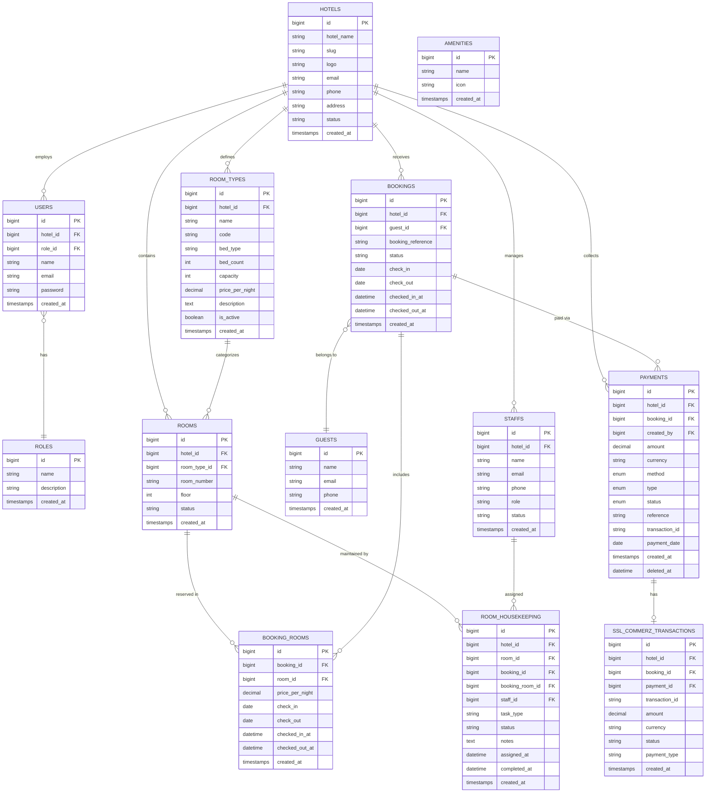

<
- [hotels](#hotels)
- [users](#users)
- [roles](#roles)
- [room_types](#room_types)
- [amenities](#amenities)
- [amenity_room_type](#amenity_room_type)
- [rooms](#rooms)
- [guests](#guests)
- [bookings](#bookings)
- [booking_rooms](#booking_rooms)
- [payments](#payments)
- [ssl_commerz_transactions](#ssl_commerz_transactions)
- [staffs](#staffs)
- [room_housekeeping](#room_housekeeping)
- [Supporting Tables](#supporting-tables)

---

## Entity Relationship Diagram

---

## hotels

Stores hotel/property information. Each hotel operates as an isolated tenant.

| Column | Type | Constraints | Description |
|---|---|---|---|
| `id` | bigint | PK, auto-increment | Primary key |
| `hotel_name` | varchar(255) | not null | Display name of the hotel |
| `slug` | varchar(255) | unique, nullable | URL-friendly identifier |
| `logo` | varchar(255) | nullable | Path to hotel logo |
| `email` | varchar(255) | nullable | Contact email |
| `phone` | varchar(255) | nullable | Contact phone |
| `address` | text | nullable | Full address |
| `status` | varchar(50) | default: `active` | Hotel status |
| `created_at` | timestamp | | |
| `updated_at` | timestamp | | |

---

## users

Authenticated users of the system. Each user belongs to one hotel.

| Column | Type | Constraints | Description |
|---|---|---|---|
| `id` | bigint | PK, auto-increment | Primary key |
| `hotel_id` | bigint | FK → hotels.id, nullable | Hotel scope |
| `role_id` | bigint | FK → roles.id, nullable | User role |
| `name` | varchar(255) | not null | Full name |
| `email` | varchar(255) | unique, not null | Login email |
| `email_verified_at` | timestamp | nullable | Verification timestamp |
| `password` | varchar(255) | not null | Bcrypt hash (12 rounds) |
| `remember_token` | varchar(100) | nullable | Session remember token |
| `created_at` | timestamp | | |
| `updated_at` | timestamp | | |

---

## roles

Defines user roles (admin, manager, receptionist, etc.).

| Column | Type | Constraints | Description |
|---|---|---|---|
| `id` | bigint | PK, auto-increment | Primary key |
| `name` | varchar(255) | not null | Role name |
| `description` | text | nullable | Role description |
| `created_at` | timestamp | | |
| `updated_at` | timestamp | | |

---

## room_types

Categories of rooms within a hotel, each with pricing and capacity details.

| Column | Type | Constraints | Description |
|---|---|---|---|
| `id` | bigint | PK, auto-increment | Primary key |
| `hotel_id` | bigint | FK → hotels.id | Hotel scope |
| `name` | varchar(255) | not null | Type name (e.g., "Deluxe Suite") |
| `code` | varchar(50) | nullable | Short code (e.g., "DLX") |
| `bed_type` | varchar(100) | nullable | Bed type (single, double, king) |
| `bed_count` | int | default: 1 | Number of beds |
| `capacity` | int | default: 2 | Maximum guests |
| `price_per_night` | decimal(10,2) | not null | Rack rate |
| `description` | text | nullable | Description |
| `is_active` | boolean | default: true | Active status |
| `created_at` | timestamp | | |
| `updated_at` | timestamp | | |

---

## amenities

Available amenities that can be assigned to room types.

| Column | Type | Constraints | Description |
|---|---|---|---|
| `id` | bigint | PK, auto-increment | Primary key |
| `name` | varchar(255) | not null | Amenity name |
| `icon` | varchar(255) | nullable | Icon class or path |
| `created_at` | timestamp | | |
| `updated_at` | timestamp | | |

---

## amenity_room_type

Pivot table linking amenities to room types (many-to-many).

| Column | Type | Constraints | Description |
|---|---|---|---|
| `amenity_id` | bigint | FK → amenities.id | |
| `room_type_id` | bigint | FK → room_types.id | |

---

## rooms

Physical rooms in the hotel inventory.

| Column | Type | Constraints | Description |
|---|---|---|---|
| `id` | bigint | PK, auto-increment | Primary key |
| `hotel_id` | bigint | FK → hotels.id | Hotel scope |
| `room_type_id` | bigint | FK → room_types.id | Room category |
| `room_number` | varchar(50) | not null | Room number/identifier |
| `floor` | int | nullable | Floor level |
| `status` | varchar(50) | default: `available` | Persisted status* |
| `created_at` | timestamp | | |
| `updated_at` | timestamp | | |

> \* **Dynamic Status**: The `status` attribute is computed at runtime via the `Room` model's accessor. Persisted values like `dirty`, `cleaning`, `maintenance`, and `out_of_order` take precedence. Otherwise, the system checks active bookings to determine `occupied` or `reserved` status dynamically.

### Status Values

| Status | Source | Meaning |
|---|---|---|
| `available` | computed | Ready for new guests |
| `occupied` | computed | Guest currently checked in |
| `reserved` | computed | Confirmed booking for today |
| `dirty` | persisted | Awaiting cleaning (set on checkout) |
| `cleaning` | persisted | Housekeeping in progress |
| `maintenance` | persisted | Under maintenance |
| `out_of_order` | persisted | Not available |

---

## guests

Guest contact information.

| Column | Type | Constraints | Description |
|---|---|---|---|
| `id` | bigint | PK, auto-increment | Primary key |
| `name` | varchar(255) | not null | Guest name |
| `email` | varchar(255) | nullable | Email |
| `phone` | varchar(50) | nullable | Phone |
| `created_at` | timestamp | | |
| `updated_at` | timestamp | | |

---

## bookings

Core reservation records.

| Column | Type | Constraints | Description |
|---|---|---|---|
| `id` | bigint | PK, auto-increment | Primary key |
| `hotel_id` | bigint | FK → hotels.id | Hotel scope |
| `guest_id` | bigint | FK → guests.id | Guest reference |
| `booking_reference` | varchar(100) | nullable | Human-readable ref |
| `guest_name` | varchar(255) | nullable | Guest name (denormalized) |
| `guest_email` | varchar(255) | nullable | Guest email (denormalized) |
| `guest_phone` | varchar(50) | nullable | Guest phone (denormalized) |
| `check_in` | date | not null | Planned check-in date |
| `check_out` | date | not null | Planned check-out date |
| `status` | varchar(50) | not null | Booking status |
| `checked_in_at` | datetime | nullable | Actual check-in timestamp |
| `checked_out_at` | datetime | nullable | Actual check-out timestamp |
| `created_at` | timestamp | | |
| `updated_at` | timestamp | | |

### Booking Status Values

| Status | Description |
|---|---|
| `reserved` | Confirmed reservation |
| `checked_in` | Guest has arrived and checked in |
| `checked_out` | Guest has departed |
| `cancelled` | Booking was cancelled |
| `no_show` | Guest did not arrive (auto or manual) |

### Computed Attributes (Model Accessors)

| Attribute | Calculation |
|---|---|
| `total_amount` | Sum of (nights × price_per_night) for all booking rooms |
| `paid_amount` | Sum of paid payments minus refunds |
| `due_amount` | `total_amount` − `paid_amount` |
| `payment_status` | `unpaid` / `partial` / `paid` based on amounts |

---

## booking_rooms

Pivot table linking bookings to rooms with per-room pricing and dates.

| Column | Type | Constraints | Description |
|---|---|---|---|
| `id` | bigint | PK, auto-increment | Primary key |
| `booking_id` | bigint | FK → bookings.id | Parent booking |
| `room_id` | bigint | FK → rooms.id | Assigned room |
| `price_per_night` | decimal(10,2) | not null | Rate for this room |
| `check_in` | date | not null | Room-specific check-in |
| `check_out` | date | not null | Room-specific check-out |
| `checked_in_at` | datetime | nullable | Actual check-in time |
| `checked_out_at` | datetime | nullable | Actual check-out time |
| `created_at` | timestamp | | |
| `updated_at` | timestamp | | |

---

## payments

Financial transactions with soft deletes for audit trail.

| Column | Type | Constraints | Description |
|---|---|---|---|
| `id` | bigint | PK, auto-increment | Primary key |
| `hotel_id` | bigint | FK → hotels.id | Hotel scope |
| `booking_id` | bigint | FK → bookings.id | Associated booking |
| `created_by` | bigint | FK → users.id | Staff who recorded |
| `amount` | decimal(10,2) | not null | Transaction amount |
| `currency` | varchar(10) | default: `BDT` | Currency code |
| `method` | enum | not null | Payment method |
| `type` | enum | not null | Payment type |
| `status` | enum | not null | Payment status |
| `reference` | varchar(255) | nullable | Transaction reference |
| `transaction_id` | varchar(255) | nullable | External transaction ID |
| `payment_date` | date | nullable | Date of payment |
| `created_at` | timestamp | | |
| `updated_at` | timestamp | | |
| `deleted_at` | timestamp | nullable | Soft delete marker |

### Enum Values

| Column | Values |
|---|---|
| `method` | `cash`, `card`, `mobile_banking`, `bank_transfer` |
| `type` | `advance`, `balance`, `refund` |
| `status` | `pending`, `paid`, `failed`, `refunded` |

**Index:** Composite index on `(hotel_id, booking_id)` for efficient lookups.

---

## ssl_commerz_transactions

Tracks SSLCommerz online payment gateway transactions.

| Column | Type | Constraints | Description |
|---|---|---|---|
| `id` | bigint | PK, auto-increment | Primary key |
| `hotel_id` | bigint | FK → hotels.id | Hotel scope |
| `booking_id` | bigint | FK → bookings.id | Associated booking |
| `payment_id` | bigint | FK → payments.id, nullable | Linked payment record |
| `transaction_id` | varchar(255) | unique, not null | SSLCommerz tran_id |
| `amount` | decimal(10,2) | not null | Transaction amount |
| `currency` | varchar(10) | default: `BDT` | Currency code |
| `status` | varchar(50) | default: `Pending` | Gateway status |
| `payment_type` | varchar(50) | nullable | Card/mobile type |
| `created_at` | timestamp | | |
| `updated_at` | timestamp | | |

---

## staffs

Hotel staff members (can be assigned to housekeeping tasks).

| Column | Type | Constraints | Description |
|---|---|---|---|
| `id` | bigint | PK, auto-increment | Primary key |
| `hotel_id` | bigint | FK → hotels.id | Hotel scope |
| `name` | varchar(255) | not null | Staff name |
| `email` | varchar(255) | nullable | Email |
| `phone` | varchar(50) | nullable | Phone |
| `role` | varchar(50) | not null | Staff role (e.g., `housekeeping`) |
| `status` | varchar(50) | default: `active` | Employment status |
| `created_at` | timestamp | | |
| `updated_at` | timestamp | | |

---

## room_housekeeping

Tracks housekeeping tasks per room, optionally linked to bookings and staff.

| Column | Type | Constraints | Description |
|---|---|---|---|
| `id` | bigint | PK, auto-increment | Primary key |
| `hotel_id` | bigint | FK → hotels.id | Hotel scope |
| `room_id` | bigint | FK → rooms.id | Target room |
| `booking_id` | bigint | FK → bookings.id, nullable | Source booking (checkout) |
| `booking_room_id` | bigint | FK → booking_rooms.id, nullable | Specific booking room |
| `staff_id` | bigint | FK → staffs.id, nullable | Assigned housekeeper |
| `task_type` | varchar(100) | not null | e.g., `checkout_cleaning` |
| `status` | varchar(50) | default: `pending` | Task status |
| `notes` | text | nullable | Additional notes |
| `assigned_at` | datetime | nullable | When staff was assigned |
| `completed_at` | datetime | nullable | When task was completed |
| `created_at` | timestamp | | |
| `updated_at` | timestamp | | |

### Task Status Values

| Status | Description |
|---|---|
| `pending` | Not yet assigned or started |
| `in_progress` | Staff assigned and working |
| `completed` | Task finished — room set to `available` if no open tasks remain |

---

## Supporting Tables

### cache

Laravel cache table (file driver used by default).

### jobs / job_batches / failed_jobs

Laravel queue tables (database driver).

### sessions

Laravel session storage (file driver by default).

### personal_access_tokens

Laravel Sanctum API tokens for headless API access.

---

## Migration Order

Migrations are designed to run in chronological order:

1. `create_users_table` — Core users + sessions
2. `create_cache_table` — Cache store
3. `create_jobs_table` — Queue jobs
4. `create_hotels_table` — Hotels
5. `create_room_types_table` — Room types
6. `create_rooms_table` — Rooms
7. `create_guests_table` — Guests
8. `create_bookings_table` — Bookings
9. `create_payments_table` — Payments
10. `create_services_table` — Services
11. `create_booking_services_table` — Booking services
12. `create_amenities_table` — Amenities
13. `create_amenity_room_type_table` — Amenity ↔ Room type pivot
14. `create_booking_rooms_table` — Booking rooms pivot
15. `update_bookings_table` — Schema refinements
16. `update_table_payments` — Payment enhancements
17. `add_checkin_checkout_to_bookings` — Actual check-in/out timestamps
18. `create_roles_table` — Roles
19. `add_role_id_to_users_table` — Role FK on users
20. `create_staff_table` — Staff
21. `create_room_housekeeping_table` — Housekeeping tasks
22. `create_personal_access_tokens_table` — Sanctum tokens
23. `create_ssl_commerz_transactions_table` — SSLCommerz
24. `add_transaction_id_and_sslcommerz_to_payments` — Payment gateway fields
]]>
